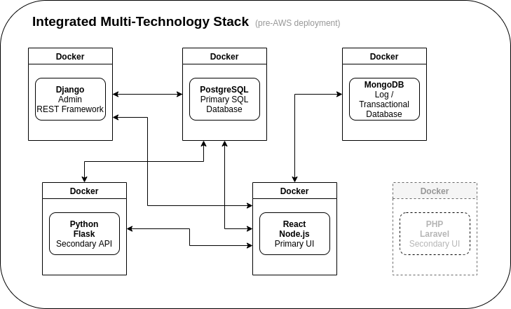

# Multi Technology Stack

[IMPORTANT DEVELOPMENT REMINDER](ReadBeforeMakingChanges.md)

## Summary

This repository contains details of all the components of this web/database stack. The purpose of this system is to showcase different technologies integrated together to manage the following:

- Code Snippets for use in different development projects
- Simple Poll Results
- To-do / Issue Tracking

## Stack Technologies

The primary philosophy during the build of this system is to deploy all distinct elements inside individual Docker containers to be hosted on AWS; keeping all changes updated through a CI/CD pipeline.  Technologies and primary purpose are as follows:

| Technology | Purpose |
| ----------- | ----------- |
| Docker | Container technology used to house individual technologies that interact to perform as a single system with multiple input/output pathways |
| Django | Backend framework, defining classes, managing data structure |
|Django REST Framework | Extends Django to provide a secure and stable API for CRUD operations |
| Python | Backend coding language, controlling all functions in the Django Framework and the APIs through the Django REST Framework and Flask REST Framework |
| PostgreSQL | Primary SQL database for all relational data |
| MongoDB | NoSQL database for transactional history and active data collections |

Additional technologies in planning stages: 

- React
- React Native
- Node.js
- PHP
- Laravel
- CodeIgniter

## System Diagram

## Task List

This task list will be incorporated into the Django backend and a link will be provided.  

### Set Up Project
- [x] Sketch out high level design
- [x] Create local repository for development
- [x] Initialize README.md with plan for project
- [X] Create Git Repo and perform initial push
- [X] Initialize framework for multiple container environment

### Configure System Back End
- [x] Deploy Django out-of-box on Docker
- [x] Deploy Postgres in separate container
- [x] Initialize Postgres as data source for Django
- [x] Verify basic Django/Postgres functionality with persistent development data store

### Build Django Applications

**Build Application #1a - Agile Sprint Scheduler**
- [x] Create data structure
- [x] Create entire Django bases application in Docker
- [ ] Port over to repository
- [ ] Possible database change to Postgres, leveraging existing container

**Build Application #1b - Code Snippet Catalog**
- [ ] Create data structure (possibly in direct scheduler system as new app)
- [ ] Create simple Django form
- [ ] Integrate with 
- [ ] Build user login (leverage from Scheduler)
- [ ] Apply user login (leverage from Scheduler)
*The primary CRUD access to this snippet catalog will be through the admin pages, React, PHP*

**Build Application #2 - Simple Poll**
- [ ] Create data structure
- [ ] Create simple Django form - No user login
- [ ] Add basic CSS styling
*Django will provide basic anonymous submit functionality.  Results visualization TBD*

**Build Application #3 - Task / Issue Tracker**
- [x] Design data structure
- [ ] Create data structure
- [ ] Create simple Django form
- [ ] Apply user login
- [ ] Migrate all historical and future tasks and issues to Tracker
*The primary CRUD access to this snippet catalog will be through the admin pages, React, PHP*

### Build REST API Capability

Set up Django REST Framework, Flask/Python framework with token authentication.  Allow all CRUD capabilities for the Code Snippet Catalog and Task / Issue Tracker.  Allow Create and Read capability for the Simple Poll.

### Build React Application to Consume REST API

Have Node talk to the API or React will directly interact with the API. 

### Additional Functionality/Technologies

- Integrate Testing (unit, function, end-to-end)
- MongoDB (log transactions, what technology performed the work, user, etc)
- Possible transition of a function from SQL to NoSQL
- PHP
- React Native (mobile)
- Data Visualization capability
- Deploy to AWS - Ensure Postgres and Mongo DB are persistent in cloud environment
- Create Code Pipeline

### Step-by-Step Documentation

- [Stack Configuration](StackConfig.md)

## References

This is a list of the primary resources used to put these technologies together.

**[Docker/Django Setup Steps](https://docs.docker.com/compose/django/)**

[Additional Repo Setup Notes](SETUP_Notes.md)